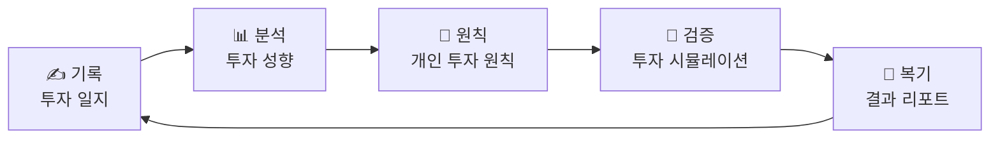
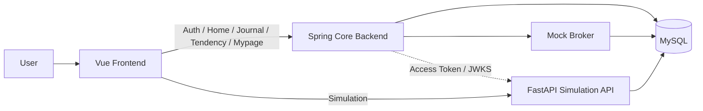
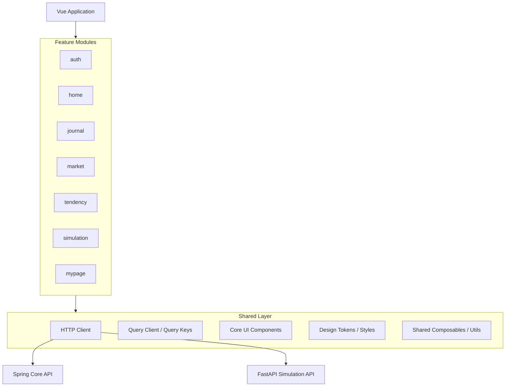
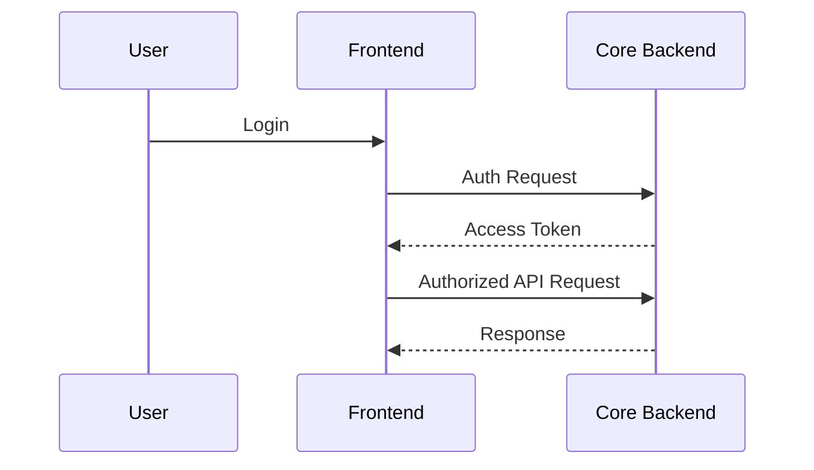
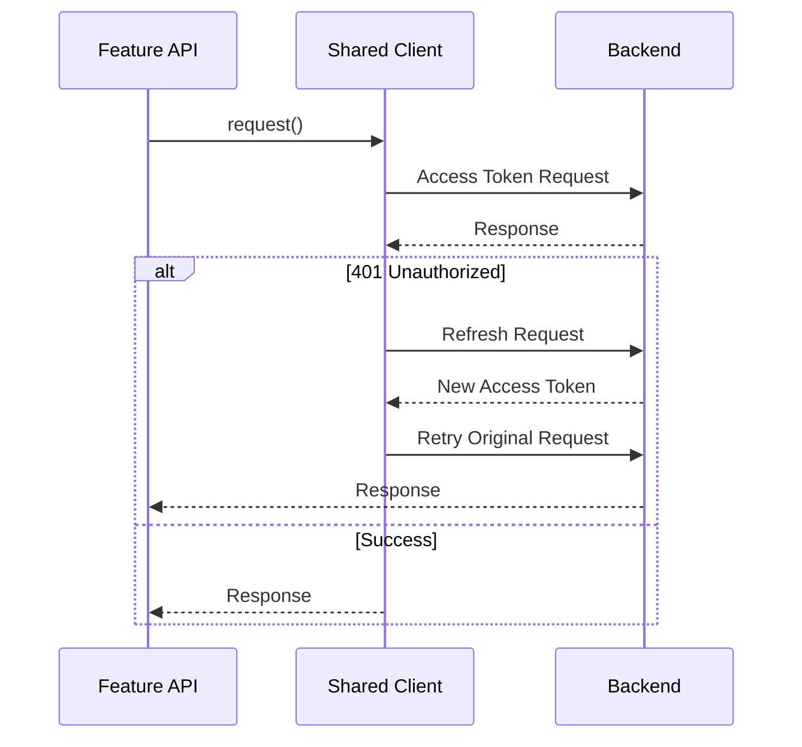

<div align="center">


# Investory Frontend

### _"모든 투자에는 이유와 이야기가 있다."_

**투자 기록을 성향과 원칙으로 바꾸고, 다시 시뮬레이션으로 검증하는 AI 투자 일지 서비스**

[](https://www.investory.kr)


<br />

`6인 팀 · Frontend 3 / Backend 3` · `Vue SPA / PWA` · `Spring Core API + FastAPI Simulation`

</div>

---

## Overview

Investory는 단순히 수익률을 기록하는 투자 서비스가 아니라, 사용자가 **왜 매수·매도를 결정했는지**를 남기고 그 판단을 다시 검토할 수 있도록 만든 AI 투자 일지 서비스입니다.

사용자의 투자 기록과 실제 거래 데이터를 바탕으로 투자 성향을 분석하고, 개인 투자 원칙을 정리한 뒤, 과거 시장 데이터에서 해당 원칙을 시뮬레이션하여 다시 복기할 수 있도록 하나의 흐름으로 연결합니다.



> **기록 → 분석 → 원칙 → 검증 → 복기**를 하나의 투자 학습 사이클로 만드는 것이 Investory의 핵심입니다.

---

## Core Features

| 기능 | 설명 |
| --- | --- |
| **Auth** | 로그인과 사용자 세션을 관리하고 서비스의 인증 흐름을 제공합니다. |
| **Home** | 연결된 계좌와 자산 정보를 바탕으로 사용자 투자 현황을 요약합니다. |
| **Journal** | 투자 판단의 이유와 매수·매도 기록을 함께 남기고 과거 의사결정을 복기합니다. |
| **Tendency** | 보유 기간, 매매 빈도, 손절, 분산, 추세 추종, 감정 개입도 등 6개 축으로 투자 성향을 분석합니다. |
| **Principle** | 투자 기록과 성향을 기반으로 반복해서 참고할 수 있는 개인 투자 원칙을 제공합니다. |
| **Simulation** | 개인 원칙을 투자 전략으로 변환하고 실제 투자 결과와 비교 전략을 과거 시장 데이터에서 검증합니다. |
| **Mypage** | 사용자 정보, 계좌 및 서비스 설정을 관리합니다. |

---

## Service Architecture

Investory는 기능 특성에 따라 Frontend, Core Backend, Simulation API, Mock Broker를 분리해 구성했습니다.



### Repository Responsibilities

| Repository | Responsibility |
| --- | --- |
| [`investory-frontend-v2`](https://github.com/kb-investory/investory-frontend-v2) | 사용자 화면, 도메인별 상태 관리, API 연동 |
| [`investory-backend`](https://github.com/kb-investory/investory-backend) | 인증, 사용자, 계좌, 투자 일지, 투자 성향 등 Core API |
| [`investory-simulation-api`](https://github.com/kb-investory/investory-simulation-api) | 개인 투자봇 생성, 백테스트, 분석, 시뮬레이션 리포트 |
| [`investory-mock-broker`](https://github.com/kb-investory/investory-mock-broker) | 실제 증권사 연동을 대체하는 가상 계좌·거래 API |

각 저장소는 기술 스택을 나누기 위한 목적보다 **서로 다른 책임과 변경 주기, 부하 특성을 분리하기 위해** 구성했습니다.

---

## Frontend Architecture

프론트엔드는 화면 단위가 아니라 **도메인 단위 Feature Module**을 중심으로 구성합니다.



기본 데이터 흐름은 다음과 같습니다.

```text
View / Component
      ↓
Feature Store / Composable
      ↓
TanStack Query
      ↓
Feature API Module
      ↓
Shared HTTP Client
      ↓
Backend
```

- `features`는 도메인별 UI, 상태, API를 함께 관리합니다.
- 서버 상태는 TanStack Vue Query, 사용자 인터랙션과 화면 흐름은 Pinia를 중심으로 관리합니다.
- 공통 HTTP 처리, Query Key, UI Component, Design Token은 `shared`에 둡니다.
- `shared`가 특정 feature를 참조하지 않도록 의존 방향을 단방향으로 유지합니다.

---

## Domain Flow

### Auth

사용자 인증과 세션 처리는 공통 HTTP Client와 Router 흐름에 연결됩니다.



여러 요청에서 인증 오류가 발생하는 경우에도 공통 Client에서 토큰 갱신과 재요청 정책을 일관되게 처리하도록 구성합니다.

### Journal

투자 일지는 단순 메모가 아니라 **거래와 판단 근거를 함께 기록하는 도메인**입니다.

```text
거래 선택
   ↓
투자 판단 기록
   ↓
일지 저장
   ↓
과거 기록 조회
   ↓
투자 판단 복기
```

### Tendency & Principle

사용자의 실제 투자 기록을 기반으로 투자 행동을 여러 축으로 분석하고, 이를 개인 투자 원칙으로 연결합니다.

```text
거래 / 일지 데이터
      ↓
투자 행동 분석
      ↓
6개 성향 축
      ↓
개인 투자 원칙
```

### Simulation

개인 투자 원칙을 실행 가능한 전략으로 변환하고, 실제 투자 결과와 비교 전략을 동일 기간에서 검증합니다.

```text
투자 원칙
   ↓
Personal Bot
   ↓
Simulation
   ↓
Actual User / Comparator 비교
   ↓
Analytics / Report
```

시뮬레이션의 비동기 Job 처리, 응답 정규화, 비교 전략 상태 관리 등 세부 구현은 별도 기술 문서에서 설명합니다.

> 📘 [Simulation Frontend Technical Notes](./docs/simulation.md)

---

## Shared HTTP Client

API 호출 과정에서 반복되는 인증 및 공통 상태 처리는 `shared/api` 계층에서 관리합니다.



- 공통 Base URL과 Authorization Header를 한 곳에서 관리합니다.
- 동시에 발생한 인증 갱신 요청을 중복 실행하지 않도록 refresh 요청을 공유합니다.
- 인증 실패 후 원 요청은 한 번만 재시도해 무한 반복을 방지합니다.
- Feature에서는 인증 구현 세부사항보다 도메인 API 사용에 집중합니다.

---

## PWA & Mobile Experience

Investory는 모바일 사용 환경을 고려해 SPA를 PWA 형태로 구성했습니다.

- `vite-plugin-pwa` 기반 Web App Manifest
- standalone display
- portrait-first orientation
- Apple Touch / 192 / 512 / maskable icon
- Workbox 기반 정적 리소스 캐시
- SPA navigation fallback

개발 환경에서는 Vite Proxy를 통해 Core API와 Simulation API를 서로 다른 서버로 연결합니다.

```text
/api/simulation/*  → Python FastAPI

/auth/*
/journal/*
/market/*
/tendency/*        → Java Spring Backend
```

---

## Tech Stack

| Category | Technology |
| --- | --- |
| Framework | Vue `3.5` |
| Build | Vite `8.0` |
| State | Pinia `3.0` |
| Server State | TanStack Vue Query `5.101` |
| Routing | Vue Router `5.1` |
| Visualization | Apache ECharts `6.1` |
| UI | Lucide Vue, Custom Core Components |
| PWA | vite-plugin-pwa, Workbox |
| Quality | ESLint, Prettier |
| Core Backend | Java 17, Spring, MyBatis |
| Simulation Backend | Python, FastAPI, pandas |
| Database | MySQL |
| Infra | Docker, CI/CD |

---

## Project Structure

```text
src/
├─ app/
│  ├─ guards/                 # Router guards
│  ├─ layouts/                # Application layouts
│  ├─ plugins/                # Application plugins
│  ├─ providers/              # QueryClient 등 전역 provider
│  ├─ router/                 # Route 정의
│  └─ views/                  # System pages
│
├─ features/
│  ├─ auth/                   # 로그인 / 인증
│  ├─ home/                   # 홈 / 자산 요약
│  ├─ journal/                # 투자 일지
│  ├─ market/                 # 종목 / 시장 데이터
│  ├─ tendency/               # 투자 성향 / 투자 원칙
│  ├─ simulation/             # 투자봇 / 백테스트 / 리포트
│  └─ mypage/                 # 사용자 / 계좌 관리
│
├─ mocks/                     # API-compatible mock data
│
├─ shared/
│  ├─ api/                    # HTTP client / Query keys
│  ├─ components/             # Core UI Components
│  ├─ composables/
│  ├─ constants/
│  ├─ services/
│  ├─ stores/
│  ├─ styles/                 # Design Tokens / Global Styles
│  └─ utils/
│
└─ main.js
```

---

## Team & Ownership

Investory는 **Frontend 3명 + Backend 3명**, 총 6명이 함께 개발한 팀 프로젝트입니다.

| 팀원 | 역할 | 주요 담당 |
| --- | --- | --- |
| **홍상우** | Team Lead · Planning · Frontend | Simulation UI/UX, Simulation Frontend, Python Simulation API |
| **한은솔** | Design · Frontend | Mypage, Tendency |
| **최동호** | Frontend | Auth, Home, Journal |
| **도윤혁** | Backend · Infra / CI/CD | Core Backend, Infra |
| **공서연** | Backend | Core Backend |
| **김태수** | Backend | Core Backend |

### Frontend Feature Ownership

```text
Frontend
├─ auth / home / journal       → 동호
├─ mypage / tendency           → 은솔
└─ simulation                  → 상우
```

각 기능은 담당자를 기준으로 개발하되, 공통 UI, API 규격, 디자인 시스템과 서비스 흐름은 팀 단위로 조율했습니다.

---

## Getting Started

### Requirements

- Node.js `^22.18.0` or `>=24.12.0`
- npm

### Install

```bash
npm install
```

### Environment

```bash
cp .env.example .env
```

주요 환경 변수 예시:

```env
VITE_API_BASE_URL=/api
VITE_API_TARGET_URL=http://localhost:8080/api/v1
VITE_AI_TARGET_URL=http://localhost:8000

VITE_USE_TEST_AUTH=false
VITE_USE_MOCK_JOURNAL=false
VITE_USE_MOCK_TENDENCY=false
VITE_USE_MOCK_SIMULATION=false
```

### Run

```bash
npm run dev
```

### Quality Check

```bash
npm run lint
npm run format:check
npm run build
```

---

## Documentation

- [서비스 기획](./docs/product-spec.md)
- [디렉터리 구조 및 아키텍처](./docs/directory-structure.md)
- [코딩 및 Git 컨벤션](./docs/coding-convention.md)
- [API 명세](./docs/API-reference/)
- [디자인 시스템](./docs/design-system/)
- [Design QA](./design-qa.md)
- [Simulation Frontend Technical Notes](./docs/simulation.md)

---

<div align="center">

### 모든 투자에는 이유와 이야기가 있다.

**기록하고, 분석하고, 원칙을 세우고, 다시 검증합니다.**

[🌐 Investory](https://www.investory.kr)

</div>
