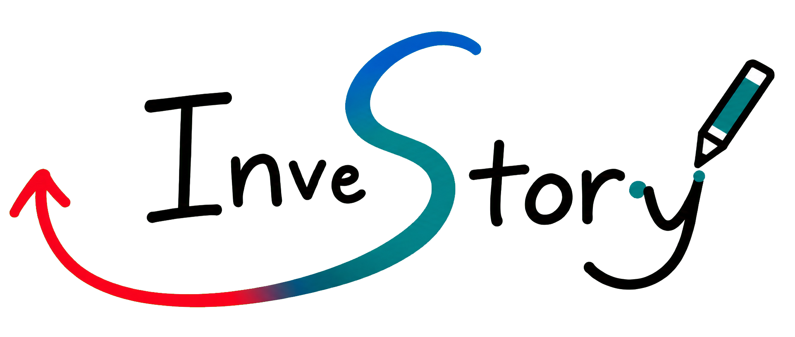
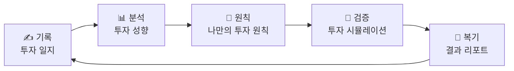
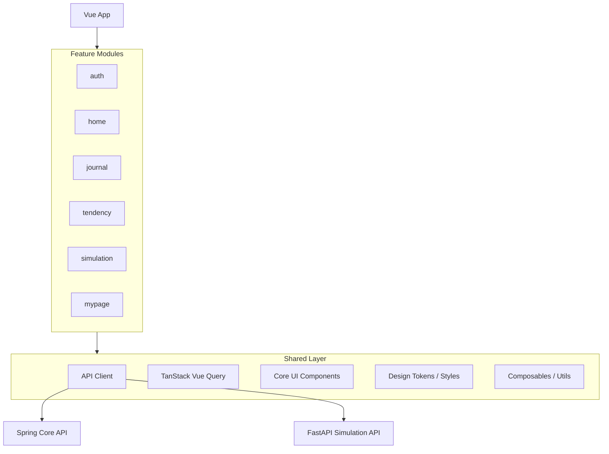
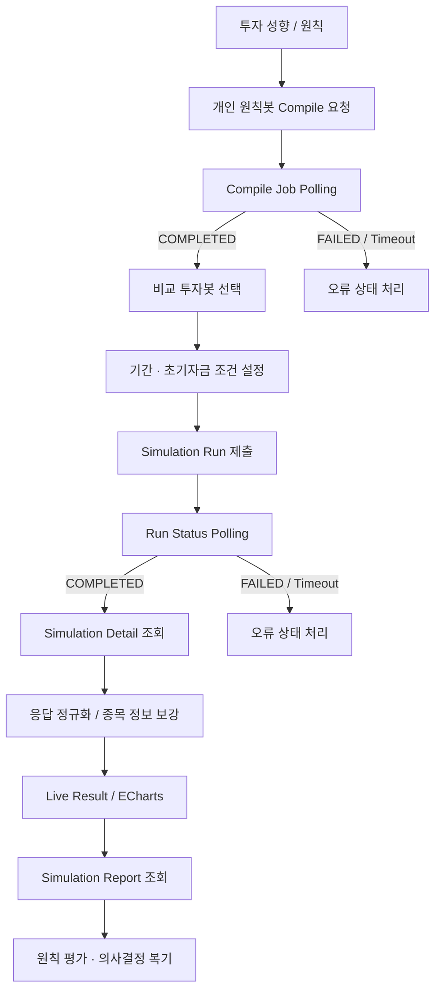
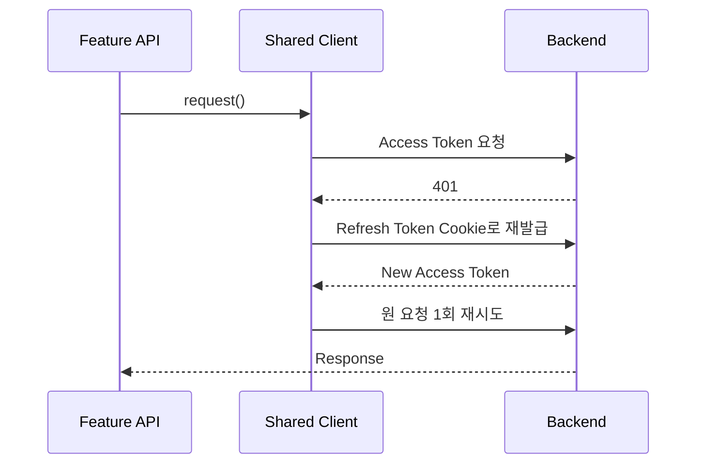

<div align="center">



# Investory Frontend

### _"모든 투자에는 이유와 이야기가 있다."_

**투자 기록을 성향과 원칙으로 바꾸고, 다시 시뮬레이션으로 검증하는 AI 투자 일지 서비스**

[](https://www.investory.kr)


<br />

`6인 팀 · Frontend 3 / Backend 3` · `Vue SPA / PWA` · `Domain-based Architecture` · `Spring Core API + FastAPI Simulation`

</div>

---

## Overview

투자 서비스는 보통 **얼마를 벌었는지**는 잘 기록하지만, 사용자가 **왜 그 순간 매수·매도를 결정했는지**까지 남겨주지는 않습니다.

Investory는 이 문제를 단순 수익률 관리가 아니라 **투자 판단의 기록과 복기** 문제로 정의했습니다.

사용자가 남긴 거래 근거와 투자 기록을 기반으로 성향을 분석하고, 나만의 투자 원칙을 도출한 뒤, 실제 과거 시장 데이터 위에서 그 원칙을 다시 검증합니다.



> **기록 → 분석 → 원칙 수립 → 검증 → 복기**를 하나의 투자 학습 사이클로 연결하는 것이 Investory의 핵심입니다.

---

## Core Experience

| 기능 | 사용자 경험 |
| --- | --- |
| **투자 일지** | 하루의 시장 느낌과 매수·매도별 판단 근거를 함께 기록하고 과거 결정을 다시 복기합니다. |
| **투자 성향 분석** | 보유 기간, 매매 빈도, 손절 패턴, 집중/분산, 추세 추종, 감정 개입도 등 6개 축으로 투자 성향을 분석합니다. |
| **투자 원칙** | 분석된 성향을 기반으로 사용자가 반복해서 참고할 수 있는 개인 투자 원칙을 제안합니다. |
| **투자 시뮬레이션** | 나의 원칙을 실행 가능한 투자봇으로 변환하고 실제 투자 기록·비교 전략과 과거 수익률을 비교합니다. |
| **결과 리포트** | 누적 수익률, 매매 내역, 포지션, 원칙 평가와 의사결정 리뷰를 한 화면에서 복기합니다. |
| **마이페이지 / 계좌** | 증권 계좌 연결 정보와 사용자 자산·설정을 관리합니다. |

---

## Frontend Architecture

프론트엔드는 화면 기준이 아니라 **도메인 기준으로 기능을 분리**했습니다.



### 데이터 흐름

```text
View / Component
      ↓
Pinia Store / Domain Composable
      ↓
TanStack Query
      ↓
Feature API Module
      ↓
Shared HTTP Client
      ↓
Backend
```

- 화면에서 API 응답을 직접 다루기보다 각 feature의 Store/API 계층을 통해 접근합니다.
- 서버 상태는 TanStack Vue Query로 캐시하고, 사용자 인터랙션 상태는 Pinia에서 관리합니다.
- 공통 컴포넌트와 API client, 디자인 토큰은 `shared`에 두고 feature 간 직접 결합을 줄였습니다.
- `shared` 레이어가 특정 feature를 참조하지 않도록 의존 방향을 단방향으로 유지합니다.

---

# 🤖 Simulation Engineering

Investory의 시뮬레이션은 단순히 수익률 숫자를 보여주는 화면이 아니라,

> **개인의 투자 원칙 → 실행 가능한 전략 → 비동기 백테스트 → 비교 분석 → 투자 복기**

를 연결하는 별도 사용자 흐름으로 설계했습니다.

## Simulation Flow



### 1. 오래 걸리는 AI 작업을 비동기 Job으로 분리

개인 원칙을 투자봇으로 컴파일하는 과정은 AI reasoning 요청 때문에 즉시 끝난다는 보장이 없습니다.

프론트에서는 `POST /simulation/bots/compile` 결과를 기다린 뒤 완료 여부를 반복 조회하는 방식으로 처리합니다.

```text
Compile Submit
   ↓
QUEUED / RUNNING
   ↓ 1s polling
COMPLETED / FAILED
```

- 최대 polling window를 별도로 두어 무한 대기를 방지합니다.
- 서버가 느린 상황을 즉시 실패로 오판하지 않도록 timeout과 `FAILED` 상태를 구분합니다.
- 빠르게 완료되어도 사용자에게 화면이 순간적으로 튀지 않도록 최소 준비 시간을 유지합니다.
- 화면을 벗어나면 request id를 갱신해 이전 polling 결과가 현재 상태를 덮어쓰지 않도록 방어합니다.

### 2. Simulation Run도 Submit / Status / Detail로 분리

백테스트 역시 결과를 동기 응답으로 기다리지 않습니다.

```text
POST /simulation/run
        ↓
Simulation Run ID
        ↓
GET /simulation/{id}/status
        ↓
COMPLETED
        ↓
GET /simulation/{id}
```

프론트는 실행 Job의 완료를 확인한 뒤에만 상세 결과를 조회합니다. 서버가 캐시된 작업에 대해 즉시 `COMPLETED`를 반환하더라도, Job 응답 자체를 결과 데이터로 잘못 해석하지 않고 항상 Detail API를 별도로 호출합니다.

### 3. API 변화에 대응하는 결과 정규화

시뮬레이션 서버 응답은 개발 과정에서 필드 위치나 naming convention이 달라질 수 있습니다.

UI가 서버 응답 shape에 직접 의존하지 않도록 API 계층에서 다음 차이를 흡수합니다.

```text
simulationRun.simulationRunId  ↔  simulationRunId / runId
snake_case                     ↔  camelCase
cumulativeReturn               ↔  cumulativeReturnPercent
portfolioValue                 ↔  totalEquity
cashBalance                    ↔  cash
```

또한 거래 결과에서 종목명이 placeholder로 내려오는 경우 Market API를 통해 실제 종목 정보를 보강하고, 동일 종목의 반복 요청은 메모리 캐시로 중복 호출을 줄입니다.

### 4. 비교 대상에 따라 결과 데이터 자체를 필터링

사용자가 선택한 비교봇만 차트에서 숨기는 수준이 아니라,

- `simulationVariants`
- `participantSummary`
- `simulatedTrades`
- `dailyPerformance`
- `positionSnapshots`

를 동일 participant 기준으로 필터링해 UI 전체의 데이터 일관성을 유지합니다.

### 5. Server State와 Flow State의 역할 분리

시뮬레이션 서버 데이터는 TanStack Query로 캐시하고, 비교봇 선택·현재 조건·Job 진행 상태처럼 사용자의 작업 흐름에 해당하는 상태는 Pinia에서 관리합니다.

주요 캐시 정책 예시:

| 데이터 | 전략 |
| --- | --- |
| Simulation Overview / Detail / Report | 짧은 stale time으로 최신 결과 반영 |
| Comparator 목록 | 상대적으로 긴 stale time으로 불필요한 재요청 감소 |
| 실행 완료 후 | Overview 관련 Query invalidate |
| 결과 완료 후 | Mypage 관련 데이터까지 invalidate |

---

## Shared HTTP Client

인증과 API 오류 처리도 각 화면마다 반복하지 않고 공통 HTTP client에서 처리합니다.



- Access Token은 메모리에서 관리합니다.
- 여러 API가 동시에 `401`을 반환해도 `refreshPromise`를 공유해 **토큰 갱신 요청을 1회로 dedup**합니다.
- 갱신 성공 후 원 요청을 한 번만 재시도해 무한 refresh loop를 방지합니다.
- 탈퇴 계정처럼 refresh로 복구할 수 없는 인증 오류는 즉시 세션 만료 흐름으로 전환합니다.

---

## PWA & Mobile Experience

Investory는 모바일 사용을 전제로 SPA를 PWA 형태로 구성했습니다.

- `vite-plugin-pwa` 기반 Web App Manifest
- standalone display
- portrait-first orientation
- Apple Touch / 192 / 512 / maskable icon 제공
- Workbox 기반 정적 리소스 캐시
- SPA navigation fallback 구성

개발 환경에서는 Vite Proxy로 Java Core API와 Python Simulation API의 target을 분리해 CORS 문제 없이 각 서버를 독립적으로 개발할 수 있습니다.

```text
/api/simulation/*  → FastAPI Simulation Server
/auth/*
/journal/*
/market/*
/tendency/*        → Spring Core Server
```

---

## Tech Stack

| 영역 | 기술 |
| --- | --- |
| Framework | Vue `3.5` |
| Build | Vite `8.0` |
| State | Pinia `3.0` |
| Server State | TanStack Vue Query `5.101` |
| Routing | Vue Router `5.1` |
| Visualization | Apache ECharts `6.1` |
| UI | Lucide Vue, Custom Core Components |
| PWA | vite-plugin-pwa, Workbox |
| Quality | ESLint, Prettier |
| Deploy | Vercel |
| Core Backend | Java 17, Spring, MyBatis |
| Simulation Backend | Python, FastAPI, pandas, SQLAlchemy, FinanceDataReader |

---

## Project Structure

```text
src/
├─ app/
│  ├─ guards/                 # Router guard
│  ├─ layouts/                # Application layout
│  ├─ plugins/                # Pinia etc.
│  ├─ providers/              # QueryClient 등 전역 provider
│  ├─ router/                 # Route 정의 / ROUTE_NAMES
│  └─ views/                  # System pages
│
├─ features/
│  ├─ auth/                   # 로그인 / 인증
│  ├─ home/                   # 자산 요약 / 홈
│  ├─ journal/                # 투자 일지 작성·조회·복기
│  ├─ market/                 # 종목 / 시장 데이터
│  ├─ tendency/               # 투자 성향 / 투자 원칙
│  ├─ simulation/             # 투자봇 생성 / 백테스트 / 리포트
│  └─ mypage/                 # 사용자 / 계좌 관리
│
├─ mocks/                     # API-compatible mock data
│
├─ shared/
│  ├─ api/                    # HTTP client / Query keys
│  ├─ components/             # Core UI Component
│  ├─ composables/
│  ├─ constants/
│  ├─ services/
│  ├─ stores/
│  ├─ styles/                 # Design Token / Global Style
│  └─ utils/
│
└─ main.js
```

### Simulation Module

```text
features/simulation/
├─ api/
│  └─ simulationApi.js        # API 호출 / 응답 정규화
├─ components/
│  ├─ SimulationDashboard.vue
│  ├─ SimulationComparatorSelect.vue
│  ├─ SimulationConditionSetup.vue
│  ├─ SimulationLiveRunner.vue
│  ├─ SimulationLiveReturnChart.vue
│  └─ SimulationResultSummary.vue
├─ composables/
│  ├─ useSimulationConditions.js
│  └─ useSimulationFlow.js    # Route 기반 flow orchestration
├─ stores/
│  └─ simulationStore.js      # Job polling / simulation state
├─ utils/
└─ views/
   └─ SimulationPage.vue
```

---

## Team & Ownership

Investory는 **Frontend 3명 + Backend 3명**, 총 6명이 함께 개발한 팀 프로젝트입니다.

| 팀원 | 역할 | 주요 담당 |
| --- | --- | --- |
| **홍상우** | **Team Lead · Planning · Frontend** | **Simulation UI/UX, Simulation Frontend, Python Simulation API** |
| **한은솔** | Design · Frontend | Mypage, Tendency |
| **최동호** | Frontend | Auth, Home, Journal |
| **도윤혁** | Backend · Infra / CI/CD | Core Backend, Infra |
| **공서연** | Backend | Core Backend |
| **김태수** | Backend | Core Backend |

### Frontend Feature Ownership

```text
Frontend
├─ auth / home / journal       → 동호
├─ mypage / tendency           → 은솔
└─ simulation                  → 상우
```

> 팀 저장소인 만큼 프로젝트 전체를 개인 작업처럼 표현하지 않고, 각 담당 영역을 기준으로 ownership을 구분합니다.

---

## Related Repositories

| Repository | Responsibility |
| --- | --- |
| [`investory-frontend-v2`](https://github.com/kb-investory/investory-frontend-v2) | Vue 기반 서비스 프론트엔드 |
| [`investory-backend`](https://github.com/kb-investory/investory-backend) | 인증·계좌·일지·성향 분석 Core API |
| [`investory-simulation-api`](https://github.com/kb-investory/investory-simulation-api) | 투자봇 생성 및 시뮬레이션 전용 FastAPI 서버 |
| [`investory-mock-broker`](https://github.com/kb-investory/investory-mock-broker) | 금융투자 정보제공 규격 기반 가상 증권사 서버 |

---

## Getting Started

### Requirements

- Node.js `^22.18.0` or `>=24.12.0`
- npm

### 1. Install

```bash
npm install
```

### 2. Environment

```bash
cp .env.example .env
```

주요 환경 변수:

```env
VITE_API_BASE_URL=/api
VITE_API_TARGET_URL=http://localhost:8080/api/v1
VITE_AI_TARGET_URL=http://localhost:8000

VITE_USE_TEST_AUTH=false
VITE_USE_MOCK_JOURNAL=false
VITE_USE_MOCK_TENDENCY=false
VITE_USE_MOCK_SIMULATION=false
```

### 3. Run

```bash
npm run dev
```

### Quality Check

```bash
npm run lint
npm run format:check
npm run build
```

---

## Documentation

- [서비스 기획](./docs/product-spec.md)
- [코딩 및 Git 컨벤션](./docs/coding-convention.md)
- [디렉터리 구조 및 아키텍처](./docs/directory-structure.md)
- [API 명세](./docs/API-reference/)
- [디자인 시스템](./docs/design-system/)
- [Design QA](./design-qa.md)

---
# Related Repositories

| Repository | Responsibility |
| --- | --- |
| [`investory-frontend-v2`](https://github.com/kb-investory/investory-frontend-v2) | Vue 기반 서비스 Frontend |
| [`investory-backend`](https://github.com/kb-investory/investory-backend) | 인증 · 계좌 · 투자 일지 · 투자 성향 Core API |
| [`investory-simulation-api`](https://github.com/kb-investory/investory-simulation-api) | Personal Bot / Backtest / Analytics / Report |
| [`investory-mock-broker`](https://github.com/kb-investory/investory-mock-broker) | 금융투자 규격 기반 가상 증권사 |

---
<div align="center">

### 모든 투자에는 이유와 이야기가 있다.

**기록하고, 분석하고, 원칙을 세우고, 다시 검증합니다.**

[🌐 Investory](https://www.investory.kr)

</div>
